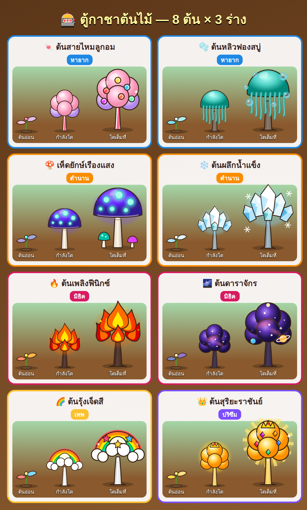
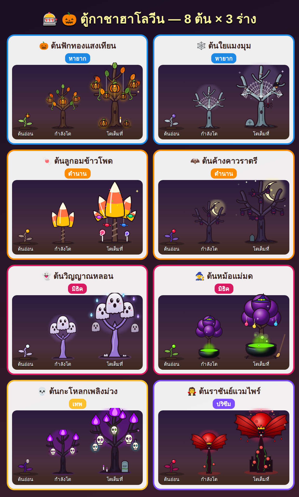
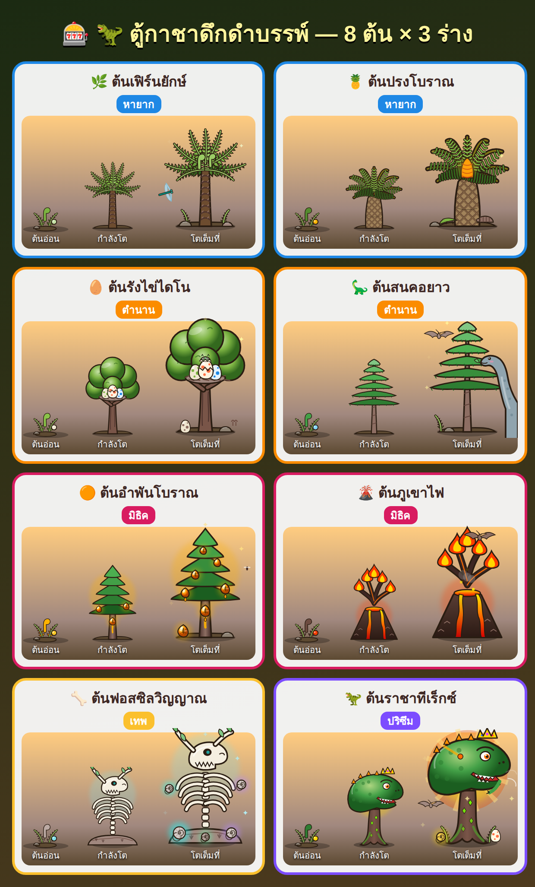

# 🌱 Grow a Garden Deluxe

เกมปลูกผักบนมือถือ เล่นในเบราว์เซอร์ได้เลย (ไฟล์เดียว `index.html` ไม่ต้องติดตั้งอะไร)

## วิธีเล่น
เปิด `index.html` ในเบราว์เซอร์ หรือเปิดผ่าน GitHub Pages

## ระบบในเกม
- 🌱 สวนแบบทุ่งโล่ง แตะตรงไหนก็ปลูกได้ สูงสุด 100 ต้น
- 🔁 ต้นไม้เก็บผลซ้ำได้ ผลแต่ละรอบสุ่มน้ำหนัก (10–1,000 kg) และสถานะใหม่
- ✨ สถานะ (Mutation) กว่า 30 แบบ ซ้อนกันได้หลายอย่าง
- 💦 สปริงเกลอร์ทำให้ผลใหญ่ขึ้น, ⛏️ พลั่วย้าย/ขุดต้นไม้
- 🐾 สัตว์เลี้ยงระบบกาชา (ไข่ 2 ชุด + ไข่จำกัดเวลา) สุ่มเกรด สุ่มขนาด
- 🎰 กาชาต้นไม้ 3 ตู้ (แฟนตาซี / 🎃 ฮาโลวีน / 🦖 ดึกดำบรรพ์) วาดด้วย SVG
- 🌦️ สภาพอากาศ, อีเวนต์, ตลาด, ผสมพันธุ์, ครัว, ความสำเร็จ, Rebirth
- 💾 เซฟอัตโนมัติ + โค้ดเซฟสำหรับย้ายเครื่อง

## ตัวอย่างต้นไม้กาชา

